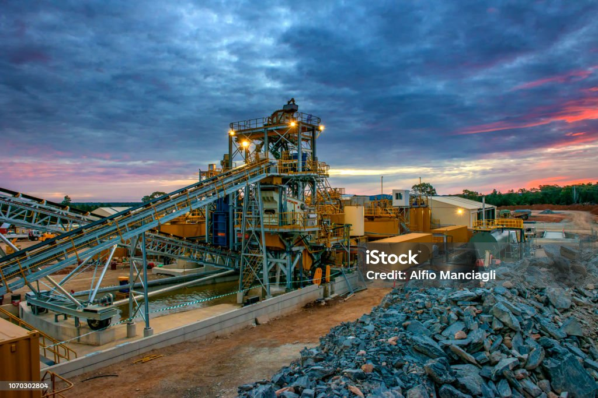

# Welcome to My Portfolio

---

### Recent Projects

#### [SQL Healthcare Data Analyst Insights](https://www.linkedin.com/posts/lexi-watts_healthcareanalytics-datascience-sql-activity-7144466841820610560-uv7-?utm_source=share&utm_medium=member_desktop)

Dive into the details of a fascinating project where I utilized SQL to uncover valuable patterns in patient data. 
From identifying top-performing medical specialties to revealing correlations between visit duration and procedure frequency, this project has been an enriching experience. Check out the article above to explore more. 

### [Python Quality Prediction in a Mining Process](https://github.com/LexiWatts/Mining-Process-Python/blob/50de0e1852809636b3fd7d583630bbc8172c9918/Notebook%201.ipynb)
 
As a data analyst, my role in this project involves identifying key quality predictors for a mining process. The primary objective is to use this data to forecast the level of impurities in the ore concentrate. Since impurity levels are measured hourly, predicting the silica content (an impurity) in the ore concentrate can provide engineers with early warnings, enabling them to take proactive measures. This allows them to reduce impurities efficiently and minimize environmental impact by decreasing the amount of ore sent to tailings.

#### [R | IBM HR Analytics Employee Attrition & Performance](https://www.linkedin.com/pulse/unlocking-insights-r-exploring-ibm-people-analytics-attrition-watts-rkaqc/)

See how I explore how to analyze key factors like employee performance and attrition using powerful tools like correlation matrices, scatter plots, and hypothesis testing. This experience has been a game-changer in enhancing my data analysis skills and understanding how R can uncover valuable insights.

### [Tableau 2023-24 NBA Stats and Analysis](https://www.linkedin.com/posts/lexi-watts_2023-24-nba-player-stats-analysis-activity-7203763527726080002-TGoZ?utm_source=share&utm_medium=member_desktop)
 
Data analysts frequently encounter scenarios where key data insights can significantly impact decision-making. What narrative does the data reveal, and what insights can drive change? I recently explored this through a project on NBA player statistics. In my PowerPoint, I discuss my rationale for each visualization type and highlight key findings in the NBA Stats Project.

#### [Excel | Market Research & Analysis - Food Delivery](https://www.linkedin.com/posts/lexi-watts_dataanalysis-marketresearch-excel-activity-7142308862623178752-3GvP?utm_source=share&utm_medium=member_desktop)

For this project, I meticulously cleaned a dataset comprising 2000 rows. Leveraging this data, I crafted insightful visualizations aimed at providing valuable market insights. The primary emphasis of my project was to uncover spending trends and translate this information.

---
#### [Tableau Massachusetss Education Dashboard](https://public.tableau.com/views/MASSEducationOverview/Dashboard1?:language=en-US&:display_count=n&:origin=viz_share_link)
#### [Loom Video Overview](https://www.loom.com/share/75e828db65fa42b9910280e24091228d?sid=6c4caec9-3e8a-4028-bd6d-221ddfec757e)

The Massachusetts Education Overview is a recent project that showcases a Tableau dashboard created from The Massachusetts Department of Education's database. The project aims to provide useful information for superintendents, including graduation rates, school performance, class size vs college attendance, and 4th-grade math level. The report provides a comprehensive overview of education in Massachusetts and offers insights that can help improve the educational system.

#### [Public Health Analyst Insights - Opioid Abuse Prevention](https://sites.google.com/view/www-oap-com/home)

The Opioid Abuse Prevention website is a site that I designed myself during my undergraduate studies that is filled will research and insights regarding the Opioid Overdose Epidemic specifically in Ohio. 

